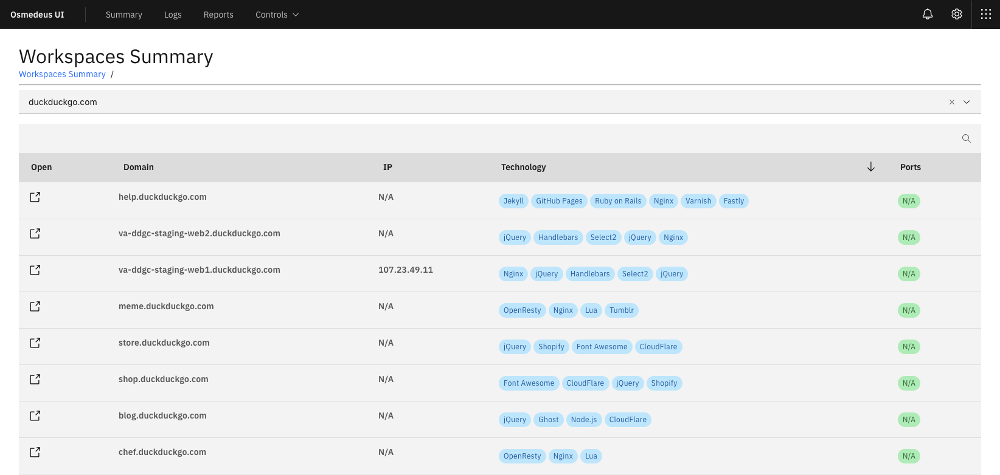
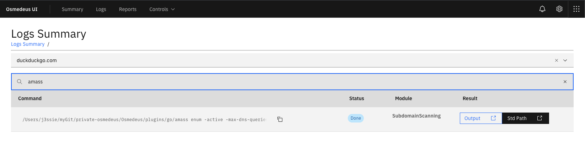
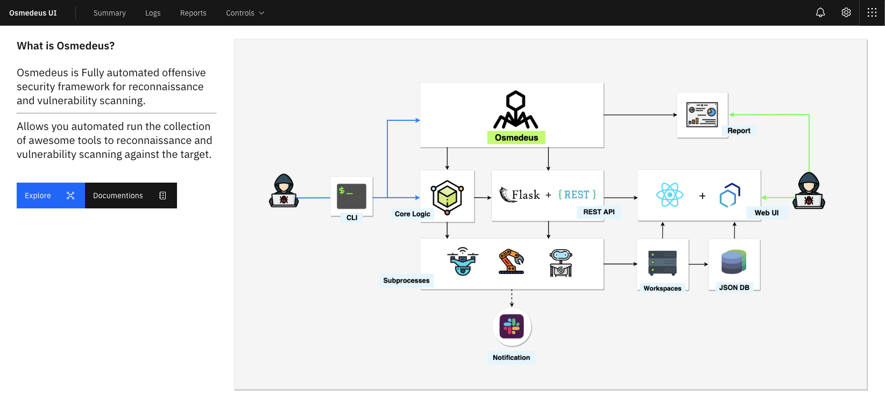

## What is Osmedeus?


Osmedeus allows you automated run the collection of awesome tools to reconnaissance and vulnerability scanning against the target.

## Installation

```
git clone https://github.com/alex14324/Osmedeus.git
cd Osmedeus
./install.sh
```


## How to use

```
./osmedeus.py -t example.com
```
## Features

- [x] Subdomain Scan.
- [x] Subdomain TakeOver Scan.
- [x] Screenshot the target.
- [x] Basic recon like Whois, Dig info.
- [x] Web Technology detection.
- [x] IP Discovery.
- [x] CORS Scan.
- [x] SSL Scan.
- [x] Wayback Machine Discovery.
- [x] URL Discovery.
- [x] Headers Scan.
- [x] Port Scan.
- [x] Vulnerable Scan.
- [x] Seperate workspaces to store all scan output and details logging.
- [x] REST API.
- [x] React [Web UI](https://github.com/j3ssie/Osmedeus/wiki/Web-UI).
- [x] Support Continuous Scan.
- [x] Slack notifications.

## Demo
[](https://asciinema.org/a/230164)









## Example Commands

```
# normal routine
./osmedeus.py -t example.com

# normal routine but slow speed on subdomain module
./osmedeus.py -t example.com --slow 'subdomain'

# direct mode examples
./osmedeus.py -m portscan -i "1.2.3.4/24"

./osmedeus.py -m portscan -I list_of_targets.txt -t result_folder

./osmedeus.py -m "portscan,vulnscan" -i "1.2.3.4/24" -t result_folder

./osmedeus.py -m "assets" -i "example.com"
./osmedeus.py -m "assets,dirb" -i "example.com"

# report mode

./osemdeus.py -t example.com --report list
./osemdeus.py -t example.com --report sum
./osemdeus.py -t example.com -m subdomain --report short
./osemdeus.py -t example.com -m "subdomain, portscan" --report full


```

## More options

```
Basic Usage
===========
python3 osmedeus.py -t <your_target>
python3 osmedeus.py -T <list_of_targets>
python3 osmedeus.py -m <module> [-i <input>|-I <input_file>] [-t workspace_name]
python3 osmedeus.py --report <mode> -t <workspace> [-m <module>]

Advanced Usage
==============
[*] List all module
python3 osmedeus.py -M

[*] List all report mode
python3 osmedeus.py --report help

[*] Running with specific module
python3 osmedeus.py -t <result_folder> -m <module_name> -i <your_target>

[*] Example command
python3 osmedeus.py -m subdomain -t example.com
python3 osmedeus.py -t example.com --slow "subdomain"
python3 osmedeus.py -t sample2 -m vuln -i hosts.txt
python3 osmedeus.py -t sample2 -m dirb -i /tmp/list_of_hosts.txt

Remote Options
==============
--remote REMOTE       Remote address for API, (default: https://127.0.0.1:5000)
--auth AUTH           Specify authentication e.g: --auth="username:password"
                      See your config file for more detail (default: core/config.conf)

--client              just run client stuff in case you ran the flask server before

More options
==============
--update              Update lastest from git

-c CONFIG, --config CONFIG
                      Specify config file (default: core/config.conf)

-w WORKSPACE, --workspace WORKSPACE
                      Custom workspace folder

-f, --force           force to run the module again if output exists
-s, --slow  "all"
                      All module running as slow mode
-s, --slow  "subdomain"
                      Only running slow mode in subdomain module

--debug               Just for debug purpose


```

## Disclaimer

Most of this tool done by the authors of the tool that list in [CREDITS.md](https://github.com/j3ssie/Osmedeus/blob/master/CREDITS.md).
I'm just put all the pieces together, plus some extra magic.

This tool is for educational purposes only. You are responsible for your own actions. If you mess something up or break any laws while using this software, it's your fault, and your fault only.

